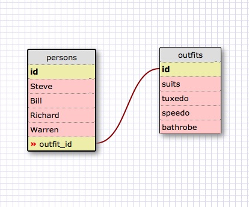

<!-- 1. Select all data for all states. -->
SELECT * FROM states;

<!-- 2. Select all data for all regions. -->
SELECT * FROM regions;

<!-- 3. Select the state_name and population for all states. -->
SELECT state_name, population FROM states;

<!-- 4. Select the state_name and population for all states ordered by population. The state with the highest population should be at the top. -->
SELECT state_name, population FROM states
ORDER BY population DESC;

<!-- 5. Select the state_name for the states in region 7. -->
SELECT state_name FROM states
WHERE region_id = 7;

<!-- 6. Select the state_name and population_density for states with a population density over 50 ordered from least to most dense. -->
SELECT state_name, population_density FROM states
WHERE population_density > 50
ORDER BY population_density ASC;

<!-- 7. Select the state_name for states with a population between 1 million and 1.5 million people. -->
SELECT state_name FROM states
WHERE population BETWEEN 1000000 AND 1500000;

<!-- 8. Select the state_name and region_id for states ordered by region in ascending order. -->
SELECT state_name, region_id FROM states
ORDER BY region_id ASC;

<!-- 9. Select the region_name for the regions with "Central" in the name. -->
SELECT region_name FROM regions
WHERE region_name LIKE '%Central';

<!-- 10. Select the region_name and the state_name for all states and regions in ascending order by region_id. Refer to the region by name. (This will involve joining the tables). -->
SELECT
regions.region_name, states.state_name
FROM states
JOIN regions ON
states.region_id = regions.id
ORDER BY states.region_id ASC;

<!-- Release 6 -->

<!--
    What are databases for?
    Data bases are used to store information as data that can be accessed, managed and updated.

    What is a one-to-many relationship?
    It's relating a row of table, the primary key to several rows, foreign keys of the relating table. It's like a parent and child relationship. The parent can have zero to many children whereas a child can only have one parent.

    What is a primary key? What is a foreign key? How can you determine which is which?
    A primary key is a unique identifier for each row of the given table that doesn't accept null values and consists of only one. A foreign key, which is connected to the primary key, contains that key in another table; compared to the primary key, there can be more than one foreign key and it can accept multiple null values.

    How can you select information out of a SQL database? What are some general guidelines for that?
    You can use SELECT command to query the database. If you want to query everything from the table, using * as the argument will show it, otherwise the argument can be the name of the column. FROM is used to specify which table to query from.
    An example to see query all columns from the table: SELECT * FROM name_of_table.
     -->
