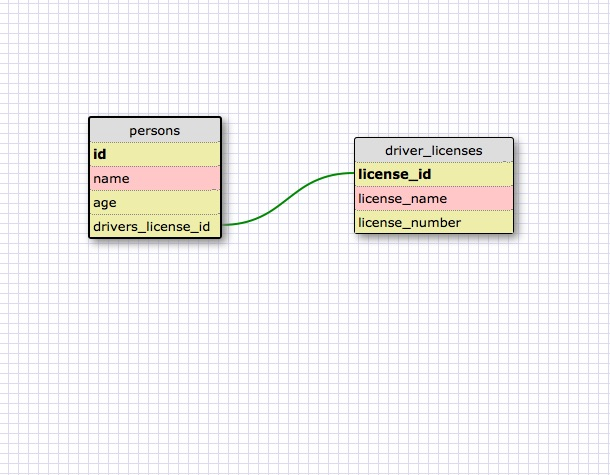

One-to-one Relationships:

I used one-to-one relationship for storing a person's drivers license because a person can only have one of them and each license number is unique and corresponds to one person. Also not everyone would have a driver's license which is why it's separated out to another table.

Many-to-many Relationships:

What is a one-to-one database?

One-to-one relationship is when the primary key only has one foreign key to another table, where one row connectw with another and each has a unique value.

When would you use a one-to-one database? (Think generally, not in terms of the example you created).

It would be used in a situation where there's only one instance existing of that category, ie a passport or driver's license per person but separated out to another table because not every person might have a passport or driver's license.

What is a many-to-many database?

Many-to-many database is when the primary key has several foreign key from different tables, joined by an additional table that connects all of the tables.

When would you use a many-to-many database? (Think generally, not in terms of the example you created).

It can be used for an order and products. Each order can have one or many products and products can be placed in one or several orders. If an order if placed, units of the products needs to be determined and what price etc, so this association can be connected through a join table that would contain quantity and price.

What is confusing about database schemas? What makes sense?

The relationships and keys were a little confusing at first but I have a better understanding now. Also the user interface of the schema builder was initially tricky to use.
